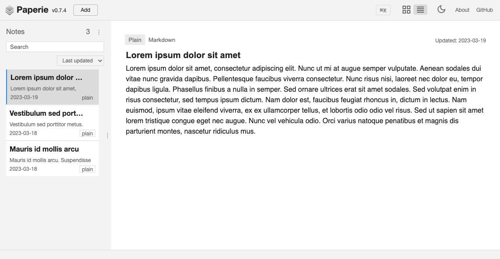
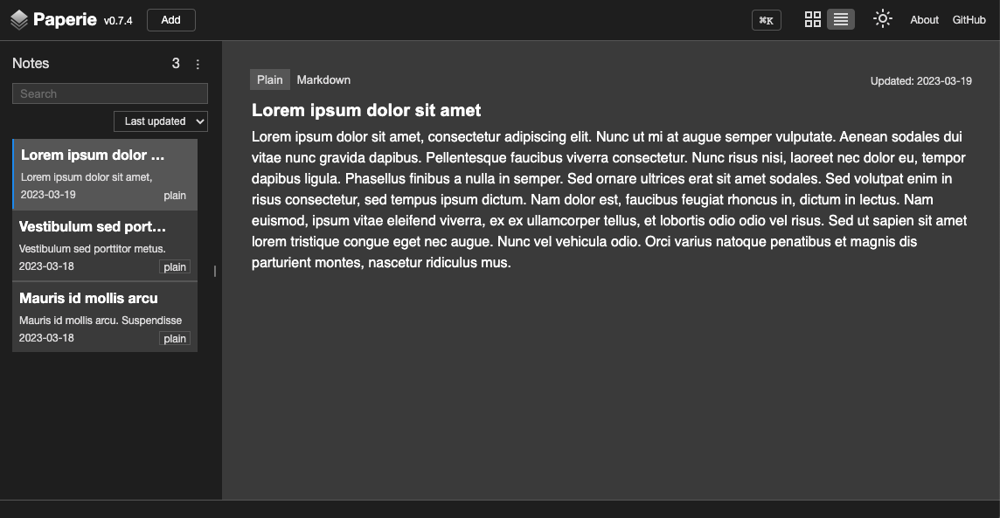

# Paperie

Paperie is a simplicity first note-taking PWA for individuals.




## Try it now

[Paperie](https://paperie.app/)

## Tech

- Tooling: [Vite](https://vitejs.dev/)
- PWA: [PWA Vite Plugin](https://vite-pwa-org.netlify.app/)
- View: [Vue](https://vuejs.org/)
- Router: [Vue Router](https://router.vuejs.org/)
- State management: [Reactivity API](https://vuejs.org/guide/scaling-up/state-management.html#simple-state-management-with-reactivity-api)
- Storage: [IndexedDB](https://developer.mozilla.org/en-US/docs/Web/API/IndexedDB_API)
- IndexedDB: [idb](https://github.com/jakearchibald/idb)
- Style: Plain old CSS for future-proof

## Icons

- [Material Symbols](https://fonts.google.com/icons?icon.set=Material+Symbols)

## Contributing

### New features

Please [open a new issue](https://github.com/sakihet/paperie/issues).

### Bug fixes

Please [open a new pull request](https://github.com/sakihet/paperie/pulls) for the given fix.

## LICENSE

MIT

## Development

```
npm install
npm run dev
```

<details>
  <summary>IDE Setup</summary>

### Recommended IDE Setup

- [VS Code](https://code.visualstudio.com/) + [Volar](https://marketplace.visualstudio.com/items?itemName=Vue.volar)

### Type Support For `.vue` Imports in TS

Since TypeScript cannot handle type information for `.vue` imports, they are shimmed to be a generic Vue component type by default. In most cases this is fine if you don't really care about component prop types outside of templates. However, if you wish to get actual prop types in `.vue` imports (for example to get props validation when using manual `h(...)` calls), you can enable Volar's Take Over mode by following these steps:

1. Run `Extensions: Show Built-in Extensions` from VS Code's command palette, look for `TypeScript and JavaScript Language Features`, then right click and select `Disable (Workspace)`. By default, Take Over mode will enable itself if the default TypeScript extension is disabled.
2. Reload the VS Code window by running `Developer: Reload Window` from the command palette.

You can learn more about Take Over mode [here](https://github.com/johnsoncodehk/volar/discussions/471).

</details>
